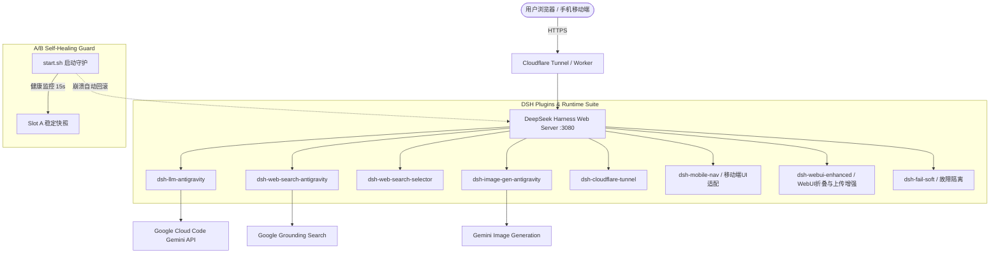

# DSH-Antigravity-Action

> 🚀 **DeepSeek Harness 云端全自动部署与 GitHub Action 运行环境**  
> 集成 Google Cloud Code (Antigravity) 顶级模型适配器、实时额度监控看板、Token 用量与前缀缓存统计、Google Grounding 网页搜索、AI 生图、移动端响应式 UI 适配、A/B 槽崩溃自愈守护以及 Cloudflare Tunnel 全自动公网穿透路由。

---

## 🧩 关联子项目仓库 (Sub-Projects & Ecosystem)

本项目作为聚合部署运行时（All-in-One Runner），由以下核心独立开源子项目构成：

| 项目仓库 | 说明 | 核心组件 |
| :--- | :--- | :--- |
| **[sprains-totem/dsh-Antigravity-Provider](https://github.com/sprains-totem/dsh-Antigravity-Provider)** | Antigravity 核心插件套件 | `dsh-llm-antigravity`<br>`dsh-web-search-antigravity`<br>`dsh-web-search-selector`<br>`dsh-image-gen-antigravity` |
| **[sprains-totem/dsh-cloudflare-tunnel](https://github.com/sprains-totem/dsh-cloudflare-tunnel)** | Cloudflare 安全穿透与路由 | `dsh-cloudflare-tunnel`<br>`cloudflare-worker.js`<br>`cloudflare-worker-proxy.js` |
| **[sprains-totem/DSH-Antigravity-Action](https://github.com/sprains-totem/DSH-Antigravity-Action)** | 云端全自动部署与自愈守护 | 本项目聚合运行时、`start.sh` A/B 自愈守护、解耦 Action 工作流 |

---

## 🌟 核心特性与插件套件

本项目为 [DeepSeek Harness](https://github.com/deepseek-ai/DeepSeek-Harness) 官方客户端在 GitHub Actions 云端环境的一键部署方案，内置全套开箱即用的 Antigravity 插件扩展与生产级运维能力：



### 1. 🌌 `dsh-llm-antigravity` (核心大模型适配器)
- **多模型支持**：无缝对接 `gemini-3.7-flash` (思考模式)、`gemini-3.7-flash-thinking`、`gemini-3.1-pro` 等官方旗舰模型。
- **⚡ 实时额度监控看板**：
  - 动态展示当前账号权益（如 `Google AI Pro` / `Antigravity` 项目状态）；
  - 实时查询 5 小时滑动窗口 (`5h`) 与每周配额 (`weekly`) 剩余百分比与 UTC 重置倒计时；
  - 智能颜色进度条（🟢 >50% / 🟡 20-50% / 🔴 <20%）与一键穿透刷新。
- **📊 Token 用量与缓存统计看板**：
  - 5 大核心 KPI：调用总次数、实际输入 Tokens、实际输出 Tokens、前缀缓存读取量（及 **~97% 前缀缓存节省率**）、思考链消耗；
  - 分模型用量聚合对比明细表与近 50 条调用流水日志记录。
- **前缀缓存与 Thought Signature 稳定中继**：
  - 精确维持多轮 Function Call 过程中的 `thoughtSignature` 连续性，最大化命中服务端前缀缓存。

### 2. 📱 `dsh-mobile-nav` (移动端触屏专属响应式适配)
- **视口自适应与抽屉化**：在窄屏设备（<1024px）下自动将桌面三栏网格重构为适合单手操作的会话流，侧边栏化身平滑滑入的抽屉（Drawer）。
- **状态栏与安全区避让**：原生适配 iPhone 刘海与 Android 手势条（`env(safe-area-inset)`），深浅色主题动态同步 `theme-color`。
- **长会话透明压缩**：Node 宿主端自动对大体积 JSON 响应启用 Brotli/Gzip 压缩，显著提升手机网络加载速度。

### 3. 🛡️ A/B 槽守护自愈与 `dsh-fail-soft` (防崩溃机制)
- **A/B 槽位快照与自动回滚 (`start.sh`)**：自动维护 Slot A 稳定快照，启动期进行 15 秒健康判定。若 Agent 自我修改导致启动崩溃，毫秒级自动回滚至稳定配置，保障服务永不下线。
- **运行时故障软隔离 (`dsh-fail-soft`)**：捕获未处理的 Promise 拒绝与异常，防止单点插件异常击穿 Node.js 进程。
- **Action 工作流解耦架构**：将生命周期逻辑与 `.github/workflows/dsh.yml` 解耦，Agent 在 Action 内部拥有完全的脚本修改权限，免受 GitHub workflows 权限限制。

### 4. 🔍 `dsh-web-search-antigravity` & `dsh-web-search-selector` (联网搜索套件)
- 基于 Google 官方 Grounding 搜索接口，为 Agent 提供实时权威的网络信息检索。
- 搜索源自由切换插件，支持在 DeepSeek 官方搜索与 Google Antigravity 搜索间随时切换。

### 5. 🎨 `dsh-image-gen-antigravity` (AI 图像生成)
- 基于 `gemini-3.1-flash-image` 接口，支持多种构图比例图像生成并在聊天流中即时渲染。

### 6. 🚇 `dsh-cloudflare-tunnel` (公网安全穿透)
- 启动即自动建立 Cloudflare Quick Tunnel，全链路 HTTPS 安全加密。
- 自动将公网临时隧道地址静默同步至 Cloudflare Worker 动态路由。

### 7. ✨ `dsh-webui-enhanced` (WebUI 交互增强套件)
- **思考与多步工具实时平铺 + 完成折叠总结**：执行过程中平铺展开，实时反馈多步工具执行与思考进度；执行完毕后自动折叠为单行总结卡片：`思考 X 次，调用工具 Y 次，共用时 Zs (输入 ... · 输出 ... · 缓存 ... · 命中率 ...%)`，支持点击展开/收起及 Token 指标切换。
- **输入框加号（`+`）多平台文件/图片上传**：常用指令菜单顶部呈现「上传图片」与「上传文件」卡片，与官方 `/` 指令完全杜绝 UI 文字重叠，智能分流多模态附件管道与代码文本。

### 8. 🌐 `dsh-easytier` (EasyTier 异地组网与 No-TUN 用户态接入)
- **容器免特权 No-TUN 模式 (`--no-tun`)**：依托内置 `smoltcp` 用户态网络协议栈，在无 `/dev/net/tun` 设备或无 Root 权限的云端 Runner / 容器中，仍可直接向虚拟局域网暴露本地 3080 服务。
- **P2P 极低延迟直连**：虚拟网内其他节点（电脑/手机）通过分配的虚拟 IP（如 `http://10.144.144.1:3080`）直连 DSH，享受点对点高速通信与内网穿透能力。
- **Action 传参与 WebUI 双向支持**：支持通过 Action 环境变量（`EASYTIER_NETWORK_NAME`、`EASYTIER_NETWORK_SECRET`、`EASYTIER_IPV4` 等）自动组网，同时在 WebUI 设置中提供可视化控制与状态看板。

### 9. 🔄 跨 Action 会话漫游与端到端隐私加密 (E2EE Session Sync)
- **多后端冗余持久化**：
  - **Git 孤立分支（`dsh-sessions`）**：0 外部依赖，利用 GitHub Token 自动在独立分支存储单 commit 覆盖备份，不膨胀主仓库体积。
  - **Cloudflare R2 / S3 兼容对象存储**：基于 `rclone` 实现秒级实时增量同步，支持多端（本地开发机、云端 Action、移动端）会话池互通。
- **🔐 端到端 AES-256 隐私强加密**：
  - 配置 `DSH_SYNC_SECRET` 密钥后，所有会话文件在离开容器前均由 OpenSSL 进行 `AES-256-CBC PBKDF2` (100k 迭代 + Salt) 加密，杜绝代码与对话隐私泄露；
  - 启动阶段自动探测、解密并原子合并还原，未配置密码或密码错误时具备严格的防损坏隔离。
- **生命周期无感守护**：
  - 启动时自动拉取历史会话并秒级还原 WebUI 对话流与索引；
  - 运行时后台守护（默认 5 分钟）增量检测变更自动推送，进程退出 / Action 取消时通过 `trap` 钩子执行最终刷盘。

---

## 🚀 快速启动指南

### 1. 配置 GitHub Repository Secrets
在仓库设置中的 **Settings -> Secrets and variables -> Actions** 中添加以下密钥：

| Secret 变量名 | 必填 | 说明 |
| :--- | :---: | :--- |
| `ANTIGRAVITY_REFRESH_TOKEN` | 是 | Google Cloud Code OAuth 2.0 Refresh Token（`1//...`） |
| `DSH_SYNC_SECRET` | 选填 | **会话同步端到端加密密钥**（配置即对 Git / R2 会话备份启用 AES-256 加密保护） |
| `R2_ACCOUNT_ID` | 选填 | Cloudflare Account ID（配置即自动启用 Cloudflare R2 对象存储会话同步） |
| `R2_ACCESS_KEY_ID` | 选填 | Cloudflare R2 Access Key ID |
| `R2_SECRET_ACCESS_KEY` | 选填 | Cloudflare R2 Secret Access Key |
| `R2_BUCKET` | 选填 | Cloudflare R2 存储桶名称（默认为 `dsh-sessions`） |
| `S3_ENDPOINT` | 选填 | 通用 S3 兼容对象存储 Endpoint（如 MinIO、阿里云 OSS、腾讯云 COS 等） |
| `S3_ACCESS_KEY_ID` | 选填 | 通用 S3 Access Key ID |
| `S3_SECRET_ACCESS_KEY` | 选填 | 通用 S3 Secret Access Key |
| `S3_BUCKET` | 选填 | 通用 S3 存储桶名称（默认为 `dsh-sessions`） |
| `CF_WORKER_URL` | 选填 | Cloudflare Worker 反向代理入口 URL（如 `https://dsh.yourdomain.workers.dev`） |
| `CF_WORKER_TOKEN` | 选填 | 用于向 Cloudflare Worker 更新隧道地址的 API 访问令牌 |
| `EASYTIER_NETWORK_NAME` | 选填 | EasyTier 异地组网的虚拟网络名称（填写即可自动启用 EasyTier 接入） |
| `EASYTIER_NETWORK_SECRET` | 选填 | EasyTier 虚拟网络访问密码 |
| `EASYTIER_IPV4` | 选填 | EasyTier 静态虚拟 IP（如 `10.144.144.1`，留空默认走 DHCP） |
| `EASYTIER_PEERS` | 选填 | EasyTier 自定义引导节点 Peer 列表（逗号分隔，留空默认使用官方公共节点） |

### 2. 触发 GitHub Actions 工作流
1. 打开仓库的 **Actions** 页面；
2. 在左侧选择 **DeepSeek Harness Server** 工作流；
3. 点击 **Run workflow**，可选择直接运行或临时输入本次运行的 `refresh_token`；
4. 运行开始后，在 Action 日志或 **Step Summary** 页面即可获取公网访问入口。

---

## 📁 目录结构

```text
.
├── .github/workflows/
│   └── dsh.yml                   # GitHub Action 轻量不可变引导工作流
├── plugins/
│   ├── dsh-mobile-nav/           # 移动端响应式与抽屉化适配插件
│   ├── dsh-fail-soft/            # 故障软隔离与全局异常捕获插件
│   ├── dsh-llm-antigravity/       # Antigravity LLM 核心驱动与额度/用量看板
│   ├── dsh-web-search-antigravity/# Google Grounding 联网搜索插件
│   ├── dsh-web-search-selector/   # 搜索源切换器插件
│   ├── dsh-image-gen-antigravity/ # Gemini 图像生成插件
│   ├── dsh-cloudflare-tunnel/     # Cloudflare 穿透与 Worker 同步插件
│   └── dsh-easytier/              # EasyTier 异地组网与 No-TUN 接入插件
├── cloudflare-worker.js          # Cloudflare Worker 动态路由代码
├── cloudflare-worker-proxy.js    # Cloudflare Worker 高性能流式反向代理
├── cordis.patch.yml              # DSH Web Profile 插件注册编排文件
├── unlock-dsh.mjs                # DSH 运行环境深度解禁与权限修补脚本
├── start.sh                      # 统一生命周期管理、A/B 槽自愈守护与启动器
├── AGENTS.md                     # Agent 规范、自我演进与工作流开发指引
└── README.md                     # 项目说明文档
```

---

## 📚 项目参考与致谢 (References & Acknowledgements)

本项目在开发与演进过程中，深度参考并致谢以下优秀开源项目与社区贡献：

1. **[DeepSeek Harness (`@deepseek-ai/dsh`)](https://github.com/deepseek-ai/DeepSeek-Harness)**  
   强大的多 Agent 运行时与 Cordis 架构微内核底座。
2. **[dsh-web-mobile (`@dsh-external/dsh-mobile-nav`)](https://github.com/mexiaosqwq/dsh-web-mobile)** by [@mexiaosqwq](https://github.com/mexiaosqwq)  
   业界领先的 DSH 移动端响应式与触屏抽屉化适配方案，提供了出色的断点布局与全树 Reconciler 调度引擎。
3. **`dsh-harness-ops` 套件 (`dsh-snapshot-ab` & `dsh-fail-soft`)**  
   为本项目提供了 A/B 槽影子验证、启动期健康窗口监控以及运行时故障软隔离的架构思想与自愈设计参考。
4. **[Google Cloud Code (Antigravity)](https://cloud.google.com/code)**  
   提供强大的 Gemini 旗舰系列大模型推理服务与 Grounding Search 接口支持。
5. **[Cloudflare Tunnel & Workers](https://www.cloudflare.com/)**  
   提供零公网端口暴露的安全隧道与边缘轻量级动态路由代理方案。
6. **[EasyTier](https://github.com/EasyTier/EasyTier)**  
   提供基于 Rust 实现的高性能去中心化 Mesh VPN，其独创的用户态 No-TUN 与 smoltcp 模式为云端无特权容器提供了极致优雅的异地组网能力。

---

## 📜 开源协议与声明
本项目基于 MIT License 协议开源，仅供学习交流与研究使用。
