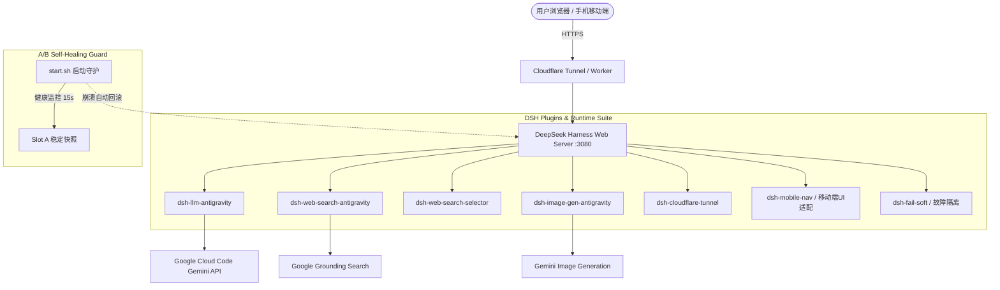

# DSH-Antigravity-Action

> 🚀 **DeepSeek Harness 云端全自动部署与 GitHub Action 运行环境**  
> 集成 Google Cloud Code (Antigravity) 顶级模型适配器、实时额度监控看板、Token 用量与前缀缓存统计、Google Grounding 网页搜索、AI 生图、移动端响应式 UI 适配、A/B 槽崩溃自愈守护以及 Cloudflare Tunnel 全自动公网穿透路由。

---

## 🌟 核心特性与插件套件

本项目为 [DeepSeek Harness](https://github.com/deepseek-ai/DeepSeek-Harness) 官方客户端在 GitHub Actions 云端环境的一键部署方案，内置全套开箱即用的 Antigravity 插件扩展与生产级运维能力：



### 1. 🌌 `dsh-llm-antigravity` (核心大模型适配器)
- **多模型支持**：无缝对接 `gemini-3.7-flash` (思考模式)、`gemini-3.7-flash-thinking`、`gemini-3.1-pro` 等官方旗舰模型。
- **⚡ 实时额度监控看板**：
  - 动态展示当前账号权益（如 `Google AI Pro` / `Antigravity` 项目状态）；
  - 实时查询 5 小时滑动窗口 (`5h`) 与每周配额 (`weekly`) 剩余百分比与 UTC 重置倒计时；
  - 智能颜色进度条（🟢 >50% / 🟡 20-50% / 🔴 <20%）与一键穿透刷新。
- **📊 Token 用量与缓存统计看板**：
  - 5 大核心 KPI：调用总次数、实际输入 Tokens、实际输出 Tokens、前缀缓存读取量（及 **~97% 前缀缓存节省率**）、思考链消耗；
  - 分模型用量聚合对比明细表与近 50 条调用流水日志记录。
- **前缀缓存与 Thought Signature 稳定中继**：
  - 精确维持多轮 Function Call 过程中的 `thoughtSignature` 连续性，最大化命中服务端前缀缓存。

### 2. 📱 `dsh-mobile-nav` (移动端触屏专属响应式适配)
- **视口自适应与抽屉化**：在窄屏设备（<1024px）下自动将桌面三栏网格重构为适合单手操作的会话流，侧边栏化身平滑滑入的抽屉（Drawer）。
- **状态栏与安全区避让**：原生适配 iPhone 刘海与 Android 手势条（`env(safe-area-inset)`），深浅色主题动态同步 `theme-color`。
- **长会话透明压缩**：Node 宿主端自动对大体积 JSON 响应启用 Brotli/Gzip 压缩，显著提升手机网络加载速度。

### 3. 🛡️ A/B 槽守护自愈与 `dsh-fail-soft` (防崩溃机制)
- **A/B 槽位快照与自动回滚 (`start.sh`)**：自动维护 Slot A 稳定快照，启动期进行 15 秒健康判定。若 Agent 自我修改导致启动崩溃，毫秒级自动回滚至稳定配置，保障服务永不下线。
- **运行时故障软隔离 (`dsh-fail-soft`)**：捕获未处理的 Promise 拒绝与异常，防止单点插件异常击穿 Node.js 进程。
- **Action 工作流解耦架构**：将生命周期逻辑与 `.github/workflows/dsh.yml` 解耦，Agent 在 Action 内部拥有完全的脚本修改权限，免受 GitHub workflows 权限限制。

### 4. 🔍 `dsh-web-search-antigravity` & `dsh-web-search-selector` (联网搜索套件)
- 基于 Google 官方 Grounding 搜索接口，为 Agent 提供实时权威的网络信息检索。
- 搜索源自由切换插件，支持在 DeepSeek 官方搜索与 Google Antigravity 搜索间随时切换。

### 5. 🎨 `dsh-image-gen-antigravity` (AI 图像生成)
- 基于 `gemini-3.1-flash-image` 接口，支持多种构图比例图像生成并在聊天流中即时渲染。

### 6. 🚇 `dsh-cloudflare-tunnel` (公网安全穿透)
- 启动即自动建立 Cloudflare Quick Tunnel，全链路 HTTPS 安全加密。
- 自动将公网临时隧道地址静默同步至 Cloudflare Worker 动态路由。

---

## 🚀 快速启动指南

### 1. 配置 GitHub Repository Secrets
在仓库设置中的 **Settings -> Secrets and variables -> Actions** 中添加以下密钥：

| Secret 变量名 | 必填 | 说明 |
| :--- | :---: | :--- |
| `ANTIGRAVITY_REFRESH_TOKEN` | 是 | Google Cloud Code OAuth 2.0 Refresh Token（`1//...`） |
| `CF_WORKER_URL` | 选填 | Cloudflare Worker 反向代理入口 URL（如 `https://dsh.yourdomain.workers.dev`） |
| `CF_WORKER_TOKEN` | 选填 | 用于向 Cloudflare Worker 更新隧道地址的 API 访问令牌 |

### 2. 触发 GitHub Actions 工作流
1. 打开仓库的 **Actions** 页面；
2. 在左侧选择 **DeepSeek Harness Server** 工作流；
3. 点击 **Run workflow**，可选择直接运行或临时输入本次运行的 `refresh_token`；
4. 运行开始后，在 Action 日志或 **Step Summary** 页面即可获取公网访问入口。

---

## 📁 目录结构

```text
.
├── .github/workflows/
│   └── dsh.yml                   # GitHub Action 轻量不可变引导工作流
├── plugins/
│   ├── dsh-mobile-nav/           # 移动端响应式与抽屉化适配插件
│   ├── dsh-fail-soft/            # 故障软隔离与全局异常捕获插件
│   ├── dsh-llm-antigravity/       # Antigravity LLM 核心驱动与额度/用量看板
│   ├── dsh-web-search-antigravity/# Google Grounding 联网搜索插件
│   ├── dsh-web-search-selector/   # 搜索源切换器插件
│   ├── dsh-image-gen-antigravity/ # Gemini 图像生成插件
│   └── dsh-cloudflare-tunnel/     # Cloudflare 穿透与 Worker 同步插件
├── cloudflare-worker.js          # Cloudflare Worker 动态路由代码
├── cloudflare-worker-proxy.js    # Cloudflare Worker 高性能流式反向代理
├── cordis.patch.yml              # DSH Web Profile 插件注册编排文件
├── unlock-dsh.mjs                # DSH 运行环境深度解禁与权限修补脚本
├── start.sh                      # 统一生命周期管理、A/B 槽自愈守护与启动器
└── README.md                     # 项目说明文档
```

---

## 📜 开源协议与声明
本项目基于 MIT License 协议开源，仅供学习交流与研究使用。
